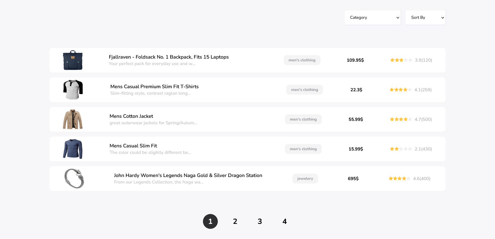

<p align="center">

</p>

<h1 align="center">
✨ Internship submission ✨ <br/>
</h1>




## Live Demo

💥 Check out the [live demo](https://61df3cd4ce4455467a900a4e--internsubmission.netlify.app/) of The app 💥


## Features

- Sort and filter by price and rating
- Pagination 


## Instructions


#### 1. Get the Code

```
git clone https://github.com/lamrouahmed/InternSubmission.git myApp
cd myApp
```

#### 2. Run the app

```
npm start
```

#### 3. Open the browser

```
http://localhost:3000/
```


